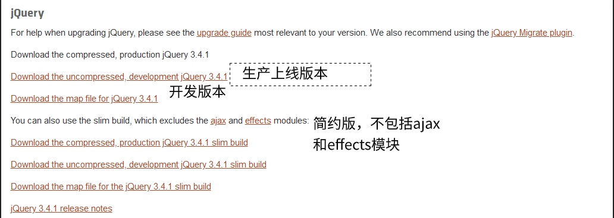
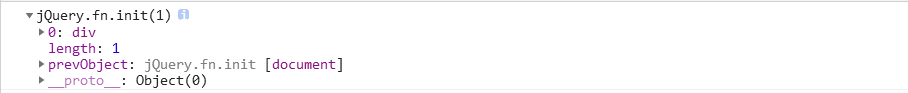
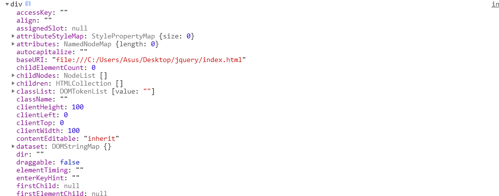
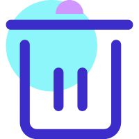
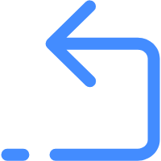

# jQuery

## 1.概述

### 1.1 JavaScript库

>  `JavaScript`库：即library,是一个封装好的函数与方法集合，即这个库中预先定义好的函数在里面，比如`animate`,`show`,`hide`等常用函数。

就库本身来说，就是一个JS文件，对我们原生的`js`代码进行封装，这样我们可以利用本有的函数快速高效的进行开发。

### 1.2 jQuery概述

`jQuery`是一个快速、简洁的`JavaScript`库，其设计宗旨是`write less,Do More`。

j 就是`JavaScript`，`Query`就是查询，即把`JavaScript`中的DOM操作进行封装，我们可以快速查询并使用库中封装好的功能。

jQuery封装了JavaScript常用的功能代码，优化DOM操作，事件处理、动画设计和Ajax交互。

我们学习`jQuery`就是学习调用这些函数与方法，学习成本低。

优点：

1. 轻量级，核心文件才几十kb,不会影响页面加载速度
2. 跨浏览器兼容，基本兼容现在的主流浏览器
3. 链式编程，隐式迭代
4. 支持插件扩展开发，有着丰富的第三方插件，如树形菜单、日期控件、轮播图等。
5. 免费、开源

## 2 基本使用

### 2.1 jQuery下载

[jQuery官网](https://jquery.com/)



选择版本

 各版本区别

* 1x:兼容IE6,7,8，官网不再更新维护
* 2x:不兼容IE6,7,8，官网不再更新维护
* 3x:不兼容IE6,7,8，是官网主要更新维护的版本

### 2.2 jQuery基本使用

做一个隐藏`div`的小案例，体验`Jquery`的便捷与高效，代码不必看懂，但需要理解`jQuery`入口函数。

```html
<!DOCTYPE html>
<html lang="en">
<head>
  <meta charset="UTF-8">
  <meta name="viewport" content="width=device-width, initial-scale=1.0">
  <meta http-equiv="X-UA-Compatible" content="ie=edge">
  <title>Document</title>
  <style>
    div{
      width: 100px;
      height: 100px;
      background-color: pink;
    }
  </style>
  <script src="./jquery.js"></script>
    //引入jQuery文件
  <script>
      //方法一：
    $(function(){
        //页面DOM加载完成时的入口
      var $div = $('div')
      $div.hide()
    })
      //方法二：
    // $(document).ready(function(){
      //页面DOM加载完成时的入口
    //   $('div').hide()
    // })
  </script>
</head>
<body>
  <div></div>
</body>
</html>
```

其中

```js
$(function(){
    ...
})
```

与

```js
$(document).ready(function(){
    ...
})
```

为Jquery的入口函数，它会等待DOM结构渲染完毕即可执行内部代码，不必等到所有外部资源加载完毕，相当于原生JavaScript中的`DOMContentLoaded`.

不同于原生JavaScript中的load事件必须等待页面文档外部`js`文件，`css`文件以及图片加载完毕才执行内部代码。

**对于上面两个入口函数，作用一致，推荐使用第一个**

### 2.3 $符号

1. $符号是jQuery的别称，在代码中可以使用jQuery代替$，但一般为了方便，通常直接使用$.

   我们可以把上面案例中的$换成`JQuery`，同样会隐藏div.

   ```js
   //js
   jQuery(function(){
       jQuery('div').hide()
   })
   ```

   

2. $是jQuery的顶级对象，相当于原生JavaScript中的window.我们可利用$把元素包装成jQuery对象，就可以调用jQuery的方法。

   ```js
   $(function(){
       console.log($('div'))
   })
   //打印jQuery对象
   ```

   

   

### 2.4 DOM对象与jQuery对象

1. DOM对象

   用原生JavaScript获取的对象就是DOM对象

   ```js
   //原生js获取对象
   window.onload = function(){
       var div = document.querySelector('div')
       console.dir(div)
       //有各种属性有方法
   }
   ```

   

2. jQuery

   用jQuery获取的对象就是jQuery对象。

   

   我们再深究jQuery对象，属性是0→`length-1`的字符串和length，这是分明就是伪数组的标配。

3. `JQuery`对象只能使用jQuery方法，DOM对象则使用原生的JavaScript属性和方法。

   ```js
   window.onload = function(){
       var div = document.querySelector('div')
       div.style.display='none'
       //原生JavaScript隐藏盒子
       // $('div').style.display= 'none' 错误
   }
   ```

###  2.5 转换

> 因为原生JavaScript比jQuery更大，如某些情况下，原生的一些属性与方法jQuery没有给我们封装，想要使用这些属性和方法就需要把jQuery对象转换为DOM对象才能使用。

我们现在想播放一个小视频，[视频链接地址](https://www.sample-videos.com/),但是`jQuery`并没有帮我们封装这个`play`方法，只能使用DOM对象的`play`方法，我们有两种方法获取DOM对象：

| 序列 | 方式                      |
| ---- | ------------------------- |
| 1    | 使用原生js获取DOM对象     |
| 2    | 将jQuery对象转换为DOM对象 |


1. 原生js获取DOM对象

   语法：`$(DOM对象)`

   ```html
   <!DOCTYPE html>
       <html lang="en">
           <head>
           <meta charset="UTF-8">
               <meta name="viewport" content="width=device-width, initial-scale=1.0">
                   <meta http-equiv="X-UA-Compatible" content="ie=edge">
                       <title>Document</title>
   <script src="./jquery.js"></script>
   <script>
       $(function(){
       var video = document.querySelector('video')
       // 原生js获取DOM元素
       console.log($(video))
       // $(video)就是一个通过DOM对象转换而来的jQuery对象
       //  但是我们不能使用$(video).play()
       // 因为jQuery对象没有play这个方法，想要播放功能只能使用DOM对象
       video.play()
   })
   </script>
   </head>
   <body>
       <video src="./test.mp4" style="width: 500px;" muted></video>
   <!-- 添加muted属性，否则谷歌默认不播放视频 -->
           </body>
   </html>
   ```

   

   * 直接获取

     ```js
     // $('DOM元素或选择器')
     ```

2. jQuery对象转换为DOM对象

   我们有两种方式可将`jQuery`对象转换为`DOM`对象：

   | 序列 | 方式                    | 备注                                 |
   | :--- | ----------------------- | ------------------------------------ |
   | 1    | $('element')[index]     | `index`是索引号，element是`html`元素 |
   | 2    | $('element').get(index) | `index`是索引号                      |

   ```js
   $(function(){
       $('video')[0].play()
   })
   ```

   


## 3 常用API

### 3.1 选择器

原生`js`获取的元素方式很多很杂，而且兼容性不一致，因此`JQuery`进行了封装，获取元素使用统一标准。

```js
$('选择器')//直接填写CSS选择器，但是要加引号
```

| 名称       | 用法                    | 描述                                                         |
| ---------- | ----------------------- | ------------------------------------------------------------ |
| ID选择器   | $('#id')                | 获取指定ID元素                                               |
| 全选选择器 | $('*')                  | 匹配所有元素                                                 |
| 类选择器   | $(".class")             | 获取同一类class元素                                          |
| 标签选择器 | $('element')            | 获取同一类标签的所有元素                                     |
| 并集选择器 | $('#id,.class,element') | 获取多个元素                                                 |
| 交集选择器 | $(".class#id")          | 选择器之间没有任何连接符，用于获取交集元素                   |
| 子代选择器 | $(".class > element")   | 使用>号，获取亲儿子层级的元素；注意，不会获取孙子层级的元素。 |
| 后代选择器 | $(".class  element")    | 使用空格，代表后代选择器，获取当前层级下的所有元素。         |

```js
//获取类型为 .nav的元素
$('.nav')
//与css选择器一致
```

#### 3.11 隐式迭代

>  遍历内部DOM元素（伪数组形式存储）的过程就叫做隐式迭代。
>
> 即将匹配到的所有元素进行循环遍历，执行相应的方法，而不用我们再循环遍历，简化我们的操作，方便我们使用。

案例：获取页面的`div`,将背景颜色设置为你喜欢的颜色。

**注意：**`jQuery`对象不能使用DOM对象的`style`之类的属性设置样式。

`jQuery`设置样式：

```js
$('element').css('属性名','属性值')
```

设置样式代码：

```js
$(function(){
    $('div').css('backgroundColor','pink')
})
```

`jQuery`对匹配到的所有`div`元素进行循环遍历，添加背景样式，应此行为不是人为，所以称为隐式迭代。

#### 3.12 筛选选择器

| 语法       | 用法                | 描述                                           |
| ---------- | ------------------- | ---------------------------------------------- |
| :first     | $("element:first")  | 获取第一个元素(element表示要获取的元素)        |
| :last      | $("element:last")   | 获取最后一个元素                               |
| :eq(index) | $("element :eq(2)") | 获取到的元素中，索引号为2的元素，索引号从0开始 |
| :odd       | $("element:odd")    | 获取到的元素中，索引号为奇数的元素             |
| :even      | $("element:even")   | 获取到的元素中，索引号为偶数的元素中           |

案例：

```html
<!DOCTYPE html>
<html lang="en">
<head>
  <meta charset="UTF-8">
  <meta name="viewport" content="width=device-width, initial-scale=1.0">
  <meta http-equiv="X-UA-Compatible" content="ie=edge">
  <title>Document</title>
  <script src="./jquery.js"></script>
  <script>
    $(function(){
      $('div:first').css("fontSize","40px")
      // 获取到的第一个div字体设置为40px
      $('div:last').css('color',"red")
       // 获取到的最后一个div颜色设置为红色
       $('div:eq(2)').css("color","pink")
       // 获取到的div索引号为2的颜色设置为粉红色
       $('div:odd').css("backgroundColor","rgb(200,200,200)")
       //索引号为奇数的背景颜色设置为灰色
       $("div:even").css("backgroundColor","rgb(100,200,200)")
       //索引号为偶数的背景颜色设置为绿色
    })
  </script>
</head>
<body>
  <div>0</div>
  <div>1</div>
  <div>2</div>
  <div>3</div>
  <div>4</div>
</body>
</html>
```

#### 3.13  jQuery的筛选方法

| 语法               | 用法                              | 说明                                     |
| ------------------ | --------------------------------- | ---------------------------------------- |
| parent( )          | $("element").parent( )            | 查找最近的父级                           |
| children(selector) | $("element").children("elenment") | 查找最近一级的子级元素，相当于子代选择器 |
| find(selector)     | $("element").find("element")      | 相当于后代选择器                         |

**注意以上全是方法**

```js
<!DOCTYPE html>
<html lang="en">
<head>
  <meta charset="UTF-8">
  <meta name="viewport" content="width=device-width, initial-scale=1.0">
  <meta http-equiv="X-UA-Compatible" content="ie=edge">
  <title>Document</title>
  <script src="./jquery.js"></script>
  <script>
    $(function(){
     $('span').parent().css('fontSize','30px')
     $('.test').children('p').css('color','red')
     $('.test').find('p').css('backgroundColor','#ccc')
    })
  </script>
</head>
<body>
  <div>
    父级
    <span></span>
  </div>
  <div class="test">
    <p>wrap</p>
    <div>
      <p>inner</p>
    </div>
  </div>
</body>
</html>
```

#### 3.14 下拉菜单

**案例：英雄联盟官网常用的更新与赛事下拉菜单：**

```html
<!DOCTYPE html>
<html lang="en">
<head>
  <meta charset="UTF-8">
  <meta name="viewport" content="width=device-width, initial-scale=1.0">
  <meta http-equiv="X-UA-Compatible" content="ie=edge">
  <title>Document</title>
  <style>
    *{
      margin: 0;
      padding: 0;
      list-style: none;
    }
    .wrap{
      margin-top: 20px;
      display: flex;
      justify-content: center;
    }
    .inner{
      width: 158px;
      padding: 0 5px 0 5px;
      background-color: rgb(209, 81, 226);
    }
    .inner>li{
      cursor: pointer;
    }
    .hide{
      display: none;
    }
  </style>
  <script src="./jquery.js"></script>
  <script>
    $(function(){
      //移入
   $('.inner').mouseover(function(){
     $(this).children('.hide').show()
       //$(this)表示当前元素，show()显示元素
   })
   //移出
   $('.inner').mouseout(function(){
     $(this).children('.hide').hide()
       //hide()隐藏元素
   })
    })
  </script>
</head>
<body>
  <div class="wrap">
    <ul class="inner">
      <li>综合</li>
      <ul class="hide">
        <li>2020LPL春季赛程公布</li>
        <li>2019德玛西亚杯冠军</li>
        <li>云顶之弈</li>
      </ul>
    </ul>
    <ul class="inner">
      <li>公告</li>
      <ul class="hide">
        <li>转区变更通知</li>
        <li>处罚名单</li>
        <li>英雄联盟更新公告</li>
      </ul>
    </ul>
    <ul class="inner">
      <li>攻略</li>
      <ul class="hide">
        <li>高胜率打野</li>
        <li>中单剑魔</li>
        <li>云顶之弈上分攻略</li>
      </ul>
    </ul>
  </div>
</body>
</html>
```

#### 3.14 其他筛选方法

| 语法                | 用法                               | 说明                                             |
| ------------------- | ---------------------------------- | ------------------------------------------------ |
| sibilings(selector) | $('element').sibilings('element')  | 查找兄弟元素，不包括自己（重要）                 |
| nextAll()           | $('element').nextAll( )            | 查找当前元素之后的所有同辈元素                   |
| pervtAll()          | $('element').prevtAll( )           | 查找当前元素之前的所有同辈元素                   |
| hasClass(class)     | $('element').hasClass('className') | 检查当前元素是否含有某个特定的类，如有，返回true |
| eq(index)           | $('element').eq(index)             | 相当于`$('element:eq(index)')`（重要）           |

```html
...
<script src="./jquery.js"></script>
<script>
    //重点掌握siblings()方法和eq()方法
    $(function(){
        //除.order外的所有兄弟元素li
        $("ol .order").siblings('li').css("color",'red')
        // 选择第n个元素
        //(1)筛选选择器
        $('ul li:eq(2)').css('backgroundColor','pink')
        //eq方法(推荐)
        $('ul li').eq(1).css('color','#ccc')
    })
</script>
</head>
<body>
    <ol>
        <li>有序1</li>
        <li class="order">有序2</li>
        <li>有序3</li>
    </ol>
    <ul>
        <li>1</li>
        <li>2</li>
        <li>3</li>
    </ul>
</body>
...
```

#### 3.15 jQuery排他思想

案例：在页面写入四个按钮，当点击某个按钮时，该按钮变色，其他的按钮恢复原来的颜色。

```html
...
<script src="./jquery.js"></script>
<script>
    $(function(){
        //利用隐式迭代思想，无需遍历
        $('button').click(function(){
            //获取当前按钮并设置背景颜色
            $(this).css('backgroundColor','pink')
            //去除其他按钮背景颜色
            $(this).siblings('button').css('backgroundColor','')
        })
    })
</script>
</head>
<body>
    <button>1</button>
    <button>2</button>
    <button>3</button>
    <button>4</button>
</body>
...
```

#### 3.16 淘宝服饰精品案例

```js

```

### 3.2 样式操作

#### 3.21 修改样式方法

> `jQuery`可以使用css方法修改简单元素样式；也可以操作类，修改多个样式。

1. 参数只写属性名，则返回属性值。

   语法格式 ：`$("elemnet").css("属性名")`

   ```js
   $(function(){
       //获取按钮的宽度
       var width = $('button').css('width')
       console.log(width) // 60px
   })
   ```

2. 参数 是属性名，属性值，并以逗号分隔，则是设置一组样式。

   语法格式：`$('elemnet').css('属性名','属性值')`;**值如果是数字，可以不加单位和引号。**

   ```js
   $(function(){
       //按钮的宽度设置为200px
       $('button').css('width',200)
       console.log($('button').css('width'))
       // 200px
   })
   ```

3. 参数可以是对象的形式，设置多组样式，属性名和属性值用冒号隔开，样式之间以逗号隔开(**属性名可以不加引号**)。

   ```js
   $(function(){
       //获取按钮的宽度
       $('button').css({width:'300px',backgroundColor:'red'})
       // 复合属性backgroundColor使用驼峰命名法
   })
   ```

#### 3.22 修改样式操作类

作用等同以前的`classList`，可以操作类样式，注意操作类里面的参数不要加点。

1. 添加类

   ```js
   //语法
   $('element').addClass('类名')
   ```

   ```html
   <!--点击按钮给div换色-->
   ...
   <style>
       div{
         width: 100px;height: 100px;
         background-color: blue;
       }
       .change{
         width: 100px;
         height: 100px;
         background-color: pink;
       }
     </style>
     <script src="./jquery.js"></script>
     <script>
       $(function(){
         $('button').click(function(){
           $('div').addClass('change')
         })
       })
     </script>
   </head>
   <body>
     <div></div>
     <button>变色</button>
   </body>
   ...
   ```

   

2. 移除类名

   ```html
   <!--给div添加change类名，点击按钮移除类名-->
   ...
   <!--css样式与上面一致-->
   <script src="./jquery.js"></script>
   <script>
       $(function(){
           $('button').click(function(){
               $('div').removeClass('change')
           })
       })
   </script>
   </head>
   <body>
       <div class="change"></div>
       <button>变色</button>
   </body>
   ...
   ```

3. 切换类

   ```js
   //语法
   $('elemnet').toggleClass('类名')
   //无类名则添加，有则取消类名
   ```

   ```html
   ...
   <style>
       div{
           width: 100px;height: 100px;
           background-color: blue;
           transition: all 0.5s;
           /* 过渡 */
       }
       .change{
           width: 100px;
           height: 100px;
           background-color: pink;
           transform: rotate(360deg);
           /* 旋转 360° */
       }
   </style>
   <script src="./jquery.js"></script>
   <script>
       $(function(){
           $('button').click(function(){
               $('div').toggleClass('change')
           })
       })
   </script>
   </head>
   <body>
       <div></div>
       <button>变色</button>
   </body>
   ...
   ```

   

#### 3.23 Tab栏切换

```html
...
<style>
    *{
      margin: 0;
      padding: 0;
      list-style: none;
    }
    section{
      width: 40%;
      margin: auto;
    }
    ul{
      display: flex;
      background-color: purple;
      justify-content: center;
    }
    ul li{
     padding: 10px 15px 10px 15px;
     font-size: large;
    }
    .content{
      background-color: rgb(149, 132, 245);
      text-align: center;
    }
    .content div{
      padding-top: 50px;
      padding-bottom: 50px;
    }
    .hide{
      display: none;
    }
    .listyle{
      background-color: sienna;
    }
  </style>
  <script src="./jquery.js"></script>
  <script>
    $(function(){
      $('ul li').mouseover(function(){
        //当前li添加类，其兄弟移除类
        $(this).addClass('listyle')
        $(this).siblings().removeClass('listyle')
        var index = $(this).index()
        $('.content div').eq(index).show()
        $('.content div').eq(index).siblings().hide()
      })
    })
  </script>
</head>
<body>
  <section>
    <ul>
      <li>规格与包装</li>
      <li>售后与保障</li>
      <li>商品评价</li>
      <li>搞基社区</li>
  </ul>
  <div class="content">
    <div>规格与包装</div>
    <div class="hide">售后与保障</div>
    <div class="hide">商品评价</div>
    <div class="hide">搞基社区</div>
  </div>
  </section>
</body>
...
```


#### 3.24 类操作与`className`的区别

### 3.3 jQuery效果

> jQuery给我们封装很多效果，最为常见的如下
>
> * 显示隐藏
> * 滑动
> * 淡入淡出
> * 自定义动画

#### 3.31显示隐藏效果

语法：

```js
//显示
show('speed',callback())
//隐藏
hide('speed',callback())
//切换
toggle('speed',callback())
```

* **speed**:三种预定速度之一的字符串("slow","normal", or "fast")或表示动画时长的毫秒数值(如：1000)

* **callback**:在动画完成时执行的函数，每个元素执行一次。

```html
<!--用显示、隐藏、切换三个按钮改变div的状态-->
<script src="./jquery.js"></script>
<script>
    $(function(){
        $('button').eq(1).click(function(){
            //隐藏
            $('div').hide('slow',function(){
                //改变div颜色
                $(this).css('backgroundColor','red')
            })
        })
        //显示
        $('button').eq(0).click(function(){
            $('div').show(1000)
        })
        //切换
        $('button').eq(2).click(function(){
            $('div').toggle('normal')
        })
    })
</script>
</head>
<body>
  <button>显示</button>
  <button>隐藏</button>
  <button>切换</button>
  <div style="width:100px;height: 100px;
  background-color: slateblue;">
  </div>
</body>
```

#### 3.32 滑动效果与事件切换

语法规范：

```js
slideDown([speed],[easing],[fn])//下拉
slideUp([speed],[easing],[fn])//上滑
slideToggle([speed],[easing],[fn])//滑动切换
```

```html
<!--用上滑、下拉、切换三个按钮改变div的状态-->
<style>
    div{
      width: 100px;
      height: 100px;
      background-color:red;
      display: none;
    }
  </style>
  <script src="./jquery.js"></script>
  <script>
    $(function(){
      //下拉
      $('button').eq(0).click(function(){
        $('div').slideDown('slow','linear')
      })
      //上滑
      $('button').eq(1).click(function(){
      $('div').slideUp(function(){
        $(this).css('backgroundColor','purple')
      })
    })
    //滑动切换
     $('button').eq(2).click(function(){
        $('div').slideToggle()
      })
    })
  </script>
</head>
<body>
  <button>下拉</button>
  <button>上滑</button>
  <button>滑动切换</button>
  <div>
  </div>
</body>
```

事件切换：

```js
//语法规范
hover([over],out)
```

| 参数 | 作用                             |
| ---- | -------------------------------- |
| over | 鼠标移到元素上要触发的函数(可选) |
| out  | 鼠标移出元素上要触发的函数       |

**如果只有参数`out`**,则其表示鼠标移到元素上或移出元素时触发执行的事件函数。

```html
// 当鼠标移入或移出span时，显示或隐藏其描述区块，使用事件切换方法
...
   <style>
    section{
      background-color: rgb(255,255,255);
      width: 300px;
    }
    span{
      background-color: rgb(151, 136, 233);
    }
    div{
      background-color: rgb(231, 139, 231);
      display: none;
    }
  </style>
  <script src="./jquery.js"></script>
  <script>
    $(function(){
      $('span').hover(function(){
        $('div').slideToggle()
        //移出或者移入时都会调用函数slideToggle()
      })
    })
  </script>
</head>
<body>
 <section>
  <span>卖炭翁</span>
  <div>
伐薪烧炭南山中，满面尘灰烟火色，
两鬓苍苍十指黑。卖炭得钱何所营？
身上衣裳口中食。可怜身上衣正单，
心忧炭贱愿天寒。
  </div>
 </section>
</body>
...
```

#### 3.33 动画队列及停止方法

1. 动画队列

   动画或效果一旦触发就会执行，如果多次触发，就会造成多个动画或效果排列。

2. 停止队列

   ```js
   stop()
   ```

   * stop用于停止动画或效果
   * stop()写到动画或效果的前面。相当于结束上一次动画。

   ```js
   //改进3.32 的案例
   $(function(){
       $('span').hover(function(){
           $('div').stop().slideToggle()
       })
   })
   ```


#### 3.34 淡入淡出效果

语法规范：

```js
fadeIn([speed],[easing],[fn])//淡入
fadeOut([speed],[easing],[fn])//淡出
fadeToggle([speed],[easing],[fn])//淡入淡出切换
fadeTo(speed,opacity,[easing],[fn])//改变透明度
```

```html
... 
<script>
    $(function(){
      $('button').eq(0).click(function(){
        $('div').fadeIn('slow')//淡入
      })
      $('button').eq(1).click(function(){
        $('div').fadeOut('1000')//淡出
      })
      $('button').eq(2).click(function(){
        $('div').stop().fadeToggle()//切换
      })
      $('button').eq(3).click(function(){
        $('div').fadeTo(100,0.9)
          //fadeTo方法必须要有参数speed和opacity
      })
    })
  </script>
</head>
<body>
 <section>
   <button>淡入</button>
   <button>淡出</button>
   <button>切换</button>
   <button>透明度</button>
   <div></div>
 </section>
</body>
...
```

```html
<!--案例
设置一组图片，鼠标移入当前图片时，其他图片透明度降低-->
...
 <style>
    section{
      background-color: rgb(82, 80, 80);
      width: 320px;
    }
    img{
      width: 100px;
      border: solid #fff 1px;
    }
  </style>
  <script src="./jquery.js"></script>
  <script>
    $(function(){
      console.log($('section img'))
     $('section img').hover(function(){
       //移入
       $(this).siblings().stop().fadeTo(100,0.1)
          // 设置div的兄弟元素透明度
       $(this).parent().siblings().stop().fadeTo(100,0.1)
     },function(){
       //移出
       $(this).siblings().stop().fadeTo(100,1)
       $(this).parent().siblings().stop().fadeTo(100,1)
     })
    })
  </script>
</head>
<body>
 <section>
   <div>
     
     
     
   </div>
   <div>
     
     
     
   </div>
 </section>
</body>
...
```

#### 3.35 自定义动画

1. 语法

   ```js
   animate(params,[speed],[easing],[fn])
   ```

   

2. 参数

   * **params**:一组包含作为动画属性和终值的样式属性和及其值的集合,以对象形式传递，属性名可以不带引号，如是复合属性，则采用驼峰命名法。

   * **speed**:三种预定速度之一的字符串("slow","normal", or "fast")或表示动画时长的毫秒数值(如：1000)

   * **easing**:指定切换效果，要使用的擦除效果的名称(需要插件支持).默认jQuery提供"linear" 和 "swing".

   * **fn**:在动画完成时执行的函数，每个元素执行一次。

```js
//点击按钮使用animate方法给div设置动画
$(function(){
    $('button').click(function(){
        $('div').animate({
            top:100,
            left:200,
            opacity:0.2
        },300)
    })
})
```

#### 3.36手风琴效果


